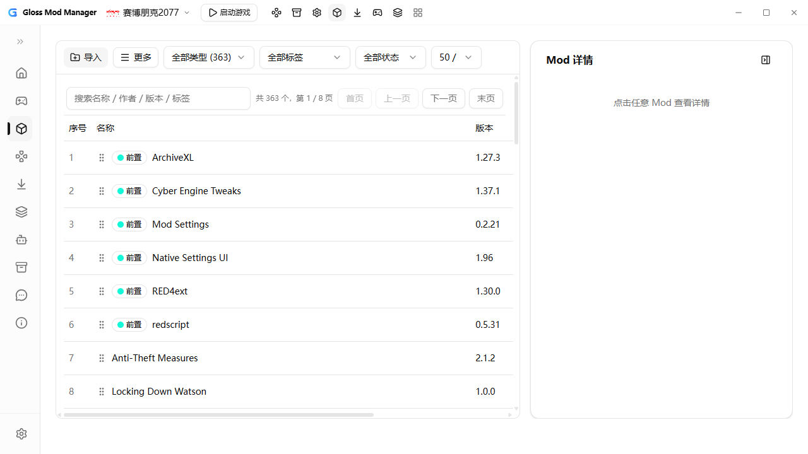
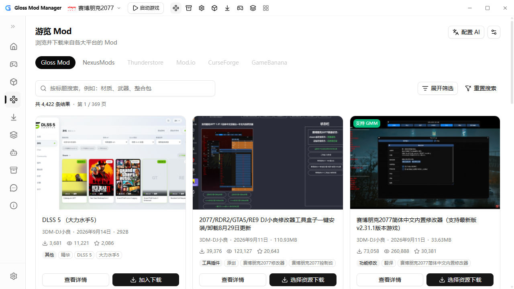
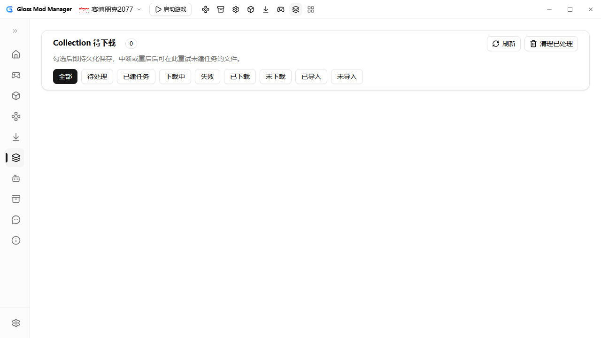
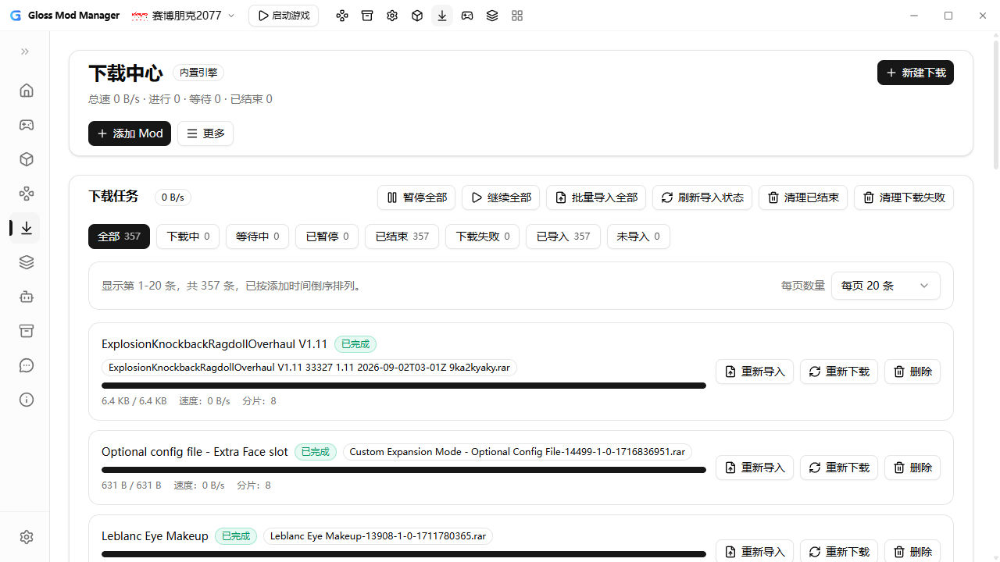
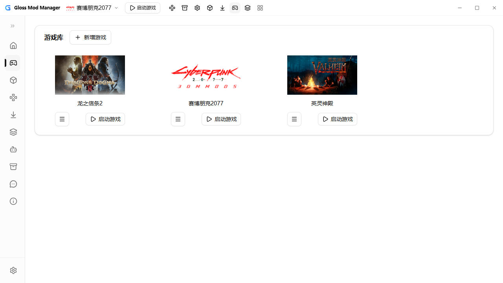
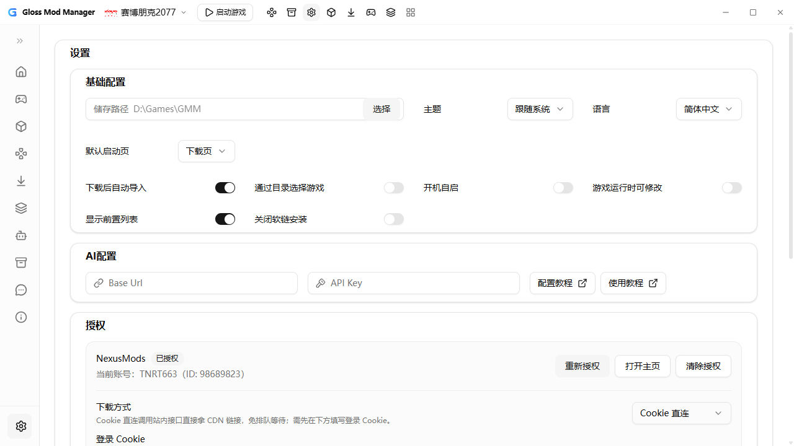

# Gloss Mod Manager — v2 分支（本 fork）

> 上游：[GlossMod/Gloss-Mod-Manager](https://github.com/GlossMod/Gloss-Mod-Manager) ｜ 本分支：`v2`，聚焦**原生下载引擎 + 后端化 + 合集/导入增强**。

## 界面预览（Tauri MCP 实机截图）

| Mod 管理                                | 浏览 / 探索                             |
| --------------------------------------- | --------------------------------------- |
|  |  |

| Collection 待下载                          | 下载中心                                 |
| ------------------------------------------ | ---------------------------------------- |
|  |  |

| 游戏库                                | 设置                                     |
| ------------------------------------- | ---------------------------------------- |
|  |  |

## 与上游 v2 的主要区别

### 1. 原生下载引擎（替换 aria2）

- Rust 自研 `downloader.rs`：多连接分片、断点续传、sidecar 状态、5s 窗口测速（对齐 aria2 口径）。
- 任务 meta / 清单 / 投影快照搬后端（`download_store` / `download_meta`），前端只做展示；统一 waiting/active/paused/error/retrying 状态机。
- 下载页：全局暂停闸、已完成任务重新下载、已结束/失败清理链、删文件确认框。
- NexusModels Cookie 直连下载（免排队），设置页可切换下载方式；凭据水合等待、过期地址重取提示。

### 2. 游览页后端化

- 列表逻辑转发 Rust（`explore.rs`），事件驱动刷新，减少前端分页/过滤开销。

### 3. Collection 合集下载（新增页面）

- `src/pages/collection.vue` + `nexus_collection.rs`：合集文件勾选即持久化，中断或重启后可继续建任务。
- Tab 化状态筛选（全部/待处理/已建任务/下载中/失败/已下载/未下载/已导入/未导入），重试进度按真完成计数。

### 4. 管理页增强

- 详情右栏 + 文件树 + 单卡片布局；标签 Popover/Select 统一下拉、批量类型标签、未打标签筛选；列表双层吸顶、导出弹窗加宽。
- 右键菜单接入（Manager/游戏/备份），全右键菜单图标补齐。
- FOMOD 安装向导（`ModuleConfig.xml` 条件选项组）+ 本地 mod 导入增强（后端并行批量导入 + 类型识别）。

### 5. 框架与体验

- 无边框窗口 + 自定义标题栏 + 左上角 Logo；顶部标题栏游戏选择器、置顶 tab 快捷入口；侧边栏手动折叠；响应式重构与 popup 适配。
- 富文本 Mod 介绍、Nexus 暗色面板、全局滚动条美化；日志从 `tauri-plugin-log` 迁移到 tracing。

## 快速开始

```bash
yarn install
yarn tauri dev        # 开发运行（需 WebView2 / 系统依赖）
yarn tauri build      # 打包前必跑，检查编译错误
```

- 前端：Vue 3 + shadcn-vue（优先用组件库，必要才自定义），Pinia 做跨组件状态。
- 代码规范见 `CodeStyle.md`；中文注释；功能细节记到 `docs/`。

## 相关链接

- 上游仓库：https://github.com/GlossMod/Gloss-Mod-Manager
- 食用教程：https://gmm.aoe.top/ ｜ 支持游戏：https://gmm.aoe.top/SupportedGames.html
- 问题反馈：[GitHub Issues](https://github.com/GlossMod/Gloss-Mod-Manager/issues) ｜ QQ群 2169033132

## License

以原仓库 license 为准。
